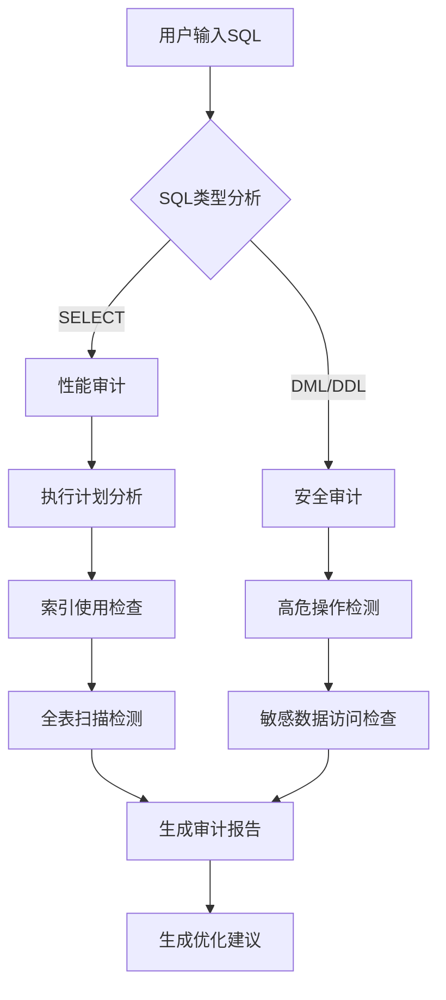

# SQL审计与优化平台 - 详细开发规范

## 项目概述
开发一个**无登录要求**的高科技风格**SQL审计与优化平台**，使用**SpringBoot 3.1 + Vue3 + TypeScript**技术栈，实现数据源配置、SQL执行、智能审计、优化建议等核心功能。界面必须具备未来科技感，采用深色主题+霓虹光效，数据可视化效果突出，无需用户认证流程，开箱即用。

## 核心功能要求

### 1. 多数据源配置管理
- **支持数据源类型**：
  - ✅ MySQL 8.x
  - ✅ PostgreSQL 14+
  - ✅ Oracle 19c
  - ✅ SQL Server 2019
  - ✅ MongoDB 6.0
- **连接参数**：
  - 主机地址、端口、数据库名
  - 用户名、密码（界面加密显示）
  - 连接超时（默认5s）
  - SSL选项（开关）
- **连接测试**：配置后立即验证连通性
- **本地存储**：使用localStorage保存配置，关闭浏览器后仍保留

### 2. SQL执行与监控
- **智能SQL编辑器**：
  - 语法高亮（支持所有数据源语法）
  - 自动补全（表名、列名、关键字）
  - 格式化（一键美化SQL）
  - 多光标编辑
- **执行控制**：
  - 超时控制（默认30秒，可配置）
  - 读写分离（标记SELECT为安全，其他为危险操作）
  - 最大结果集限制（默认1000条，可配置）
- **实时监控**：
  - 执行时间精确到毫秒
  - 影响行数统计
  - 网络流量监控

### 3. 智能审计引擎
- **性能审计**：
  - EXPLAIN分析（MySQL/PostgreSQL）
  - 执行计划可视化
  - 全表扫描检测
  - 临时表/文件排序警告
- **安全审计**：
  - SQL注入风险检测
  - 敏感数据访问检测（如password字段）
  - 未参数化查询警告
  - 高危操作检测（DROP/DELETE无WHERE）
- **规范审计**：
  - 大写/小写风格检查
  - 必须使用表别名
  - 禁止SELECT *
  - JOIN规范检查
- **索引审计**：
  - 缺失索引建议
  - 重复索引检测
  - 低效索引识别

### 4. 优化建议系统
- **SQL重写建议**：
  - 子查询转JOIN
  - NOT IN优化
  - OR条件优化
- **索引建议**：
  - 推荐CREATE INDEX语句
  - 复合索引列顺序优化
  - 覆盖索引建议
- **表结构建议**：
  - 分区表建议
  - 字段类型优化
  - 归档策略建议
- **执行计划优化**：
  - 强制索引使用
  - 查询重写策略
  - 统计信息更新建议

## 技术栈规范

### 后端 (SpringBoot 3.1)
```yaml
framework: 
  - Spring Boot 3.1.5
  - Java 17
  - Spring JDBC (轻量级，无需ORM)
  - HikariCP (连接池)

core_libraries:
  - JSqlParser 4.6 (SQL解析)
  - Druid 1.2.16 (SQL分析)
  - Jackson 2.15 (JSON处理)
  - Apache Commons Lang3 (工具类)

architecture:
  - 单体架构（无需微服务）
  - RESTful API设计
  - 无状态设计（不存储用户会话）
  - 异步执行（CompletableFuture）

security:
  - 无用户认证
  - SQL注入防护（参数化查询）
  - 请求频率限制（10次/秒/IP）
```

### 前端 (Vue3 + TypeScript)
```yaml
core:
  - Vue 3.4.15
  - TypeScript 5.3.3
  - Vite 5.0.12
  - Pinia 2.1.7 (状态管理，无持久化)

ui_framework:
  - Naive UI (组件库，支持暗色主题)
  - Monaco Editor (SQL编辑器)
  - ECharts 5.4.3 (数据可视化)

visualization:
  - 3D执行计划图（使用Three.js）
  - 霓虹光效组件
  - 动态粒子背景

build:
  - Vite生产优化
  - 按需引入组件
  - 代码分割
```

## 界面设计规范 (高科技风格)

### 主题要求
- **主色调**：深空黑 (#0f0f1b) + 霓虹蓝 (#00f3ff) + 电子紫 (#b967ff)
- **字体**： 
  - 标题：Orbitron (科技感)
  - 代码：JetBrains Mono
  - 正文：HarmonyOS Sans
- **动效**：
  - 按钮悬停：霓虹光晕
  - 数据加载：粒子流动动画
  - 重要警告：脉冲红光效果

### 核心页面布局
```vue
<template>
  <div class="sql-audit-platform">
    <!-- 全局粒子背景 -->
    <ParticleBackground />
    
    <div class="header">
      <h1>SQL<span class="neon-accent">AUDIT</span></h1>
      <DataSourceManager />
    </div>
    
    <div class="main-content">
      <!-- 左侧：SQL编辑器 -->
      <div class="editor-section">
        <div class="editor-header">
          <span class="connection-status" :class="{active: isConnected}">
            {{ currentDataSource?.name || '未连接' }}
          </span>
          <div class="editor-controls">
            <Button variant="neon" @click="formatSQL">格式化</Button>
            <Button variant="neon" @click="explainSQL">执行计划</Button>
            <Button variant="danger" @click="executeSQL" :disabled="!isConnected">
              <span class="pulse-ring"></span>
              执行SQL
            </Button>
          </div>
        </div>
        <MonacoEditor 
          v-model="sqlContent" 
          language="sql" 
          theme="vs-dark"
          :options="editorOptions"
        />
      </div>
      
      <!-- 右侧：结果与审计 -->
      <div class="results-section">
        <Tabs>
          <TabPane name="results" tab="执行结果">
            <ResultTable :data="queryResult" />
          </TabPane>
          <TabPane name="audit" tab="审计报告">
            <AuditReport :report="auditReport" />
          </TabPane>
          <TabPane name="optimization" tab="优化建议">
            <OptimizationSuggestions :suggestions="optimizationSuggestions" />
          </TabPane>
          <TabPane name="execution-plan" tab="执行计划" v-if="executionPlan">
            <ExecutionPlan3D :plan="executionPlan" />
          </TabPane>
        </Tabs>
      </div>
    </div>
    
    <div class="status-bar">
      <span>{{ executionTime }}ms</span>
      <span>{{ affectedRows }} rows</span>
      <span class="risk-level" :class="riskClass">{{ riskLevel }}风险</span>
    </div>
  </div>
</template>
```

### 关键界面效果
1. **仪表盘**：
   - 3D立体数据源连接状态
   - 实时执行性能仪表盘
   - 安全风险热力图

2. **SQL编辑器**：
   - 霓虹语法高亮
   - 行号左侧显示审计警告图标
   - 悬停显示详细建议

3. **审计报告**：
   - 雷达图展示多维评分（性能/安全/规范）
   - 问题卡片采用全息投影效果
   - 点击问题跳转到SQL对应位置

4. **优化建议**：
   - 比较视图（原始SQL vs 优化SQL）
   - 预期性能提升百分比
   - 一键应用优化建议

## API接口设计

### 后端API
```java
@RestController
@RequestMapping("/api")
public class SqlAuditController {

    // 1. 数据源管理
    @PostMapping("/datasources/test")
    public ResponseEntity<DataSourceTestResult> testConnection(@RequestBody DataSourceConfig config) {
        // 测试连接
    }
    
    // 2. SQL执行
    @PostMapping("/execute")
    public ResponseEntity<QueryResult> executeSql(@RequestBody ExecuteRequest request) {
        // 执行SQL，返回结果
    }
    
    // 3. SQL审计
    @PostMapping("/audit")
    public ResponseEntity<AuditReport> auditSql(@RequestBody AuditRequest request) {
        // 审计SQL，返回报告
    }
    
    // 4. 优化建议
    @PostMapping("/optimize")
    public ResponseEntity<OptimizationResponse> optimizeSql(@RequestBody OptimizeRequest request) {
        // 生成优化建议
    }
    
    // 5. 执行计划
    @PostMapping("/explain")
    public ResponseEntity<ExecutionPlan> getExecutionPlan(@RequestBody ExplainRequest request) {
        // 获取执行计划
    }
}
```

### 关键请求/响应结构
```java
// 数据源配置
@Data
public class DataSourceConfig {
    private String type; // mysql, postgresql, oracle, sqlserver, mongodb
    private String host;
    private int port;
    private String database;
    private String username;
    private String password;
    private boolean sslEnabled;
    private int timeout = 5000;
}

// 审计报告
@Data
public class AuditReport {
    private PerformanceScore performance;
    private SecurityScore security;
    private StandardScore standard;
    private List<AuditIssue> issues; // 问题列表
    private String riskLevel; // LOW/MEDIUM/HIGH
    private List<IndexSuggestion> indexSuggestions;
}

// 优化建议
@Data
public class OptimizationSuggestion {
    private String originalSql;
    private String optimizedSql;
    private String category; // PERFORMANCE/SECURITY/STANDARD
    private double expectedImprovement; // 预期提升百分比
    private String explanation;
    private List<String> applySteps; // 应用步骤
}
```

## 核心业务逻辑

### 1. SQL审计引擎流程


### 2. 高危操作防护策略
- **自动拦截**：
  - DROP DATABASE
  - TRUNCATE TABLE
  - DELETE without WHERE
- **二次确认**：
  - DML语句影响>1000行
  - 修改系统表
  - 非工作时间操作（22:00-6:00）
- **语法分析**：
  - 使用JSqlParser解析SQL结构
  - 检测UNION SELECT注入
  - 识别注释中的恶意代码

### 3. 优化建议生成逻辑
1. **性能优化**：
   - 如果存在全表扫描且结果集<10%：建议创建索引
   - 如果存在子查询：尝试重写为JOIN
   - 如果存在OR条件：建议使用UNION ALL
2. **安全优化**：
   - 识别字符串拼接：建议参数化查询
   - 检测密码字段：建议使用哈希存储
3. **规范优化**：
   - SELECT *：建议明确列出字段
   - 未使用表别名：建议添加别名

## 代码结构规范

### 后端目录结构
```
src/main/java/com/sqlaudit/
├── config/                # 配置类
│   ├── DataSourceConfig.java
│   └── WebConfig.java
├── controller/            # 控制器
│   └── SqlAuditController.java
├── service/               # 服务层
│   ├── impl/
│   │   ├── DataSourceServiceImpl.java
│   │   ├── SqlExecutorServiceImpl.java
│   │   ├── SqlAuditorServiceImpl.java
│   │   └── OptimizationEngineImpl.java
│   └── SqlAuditService.java
├── util/                  # 工具类
│   ├── SqlParserUtil.java
│   ├── ExplainPlanParser.java
│   └── SecurityScanner.java
├── dto/                   # 数据传输对象
│   ├── request/
│   └── response/
└── SqlAuditApplication.java
```

### 前端目录结构
```
src/
├── api/                   # API请求
│   ├── dataSource.js
│   ├── sqlExecutor.js
│   └── auditEngine.js
├── assets/                # 静态资源
│   ├── fonts/
│   └── particles.json
├── components/            # 公共组件
│   ├── editor/
│   │   ├── MonacoEditor.vue
│   │   └── SqlSuggestions.vue
│   ├── visualization/
│   │   ├── ExecutionPlan3D.vue
│   │   └── AuditRadarChart.vue
│   └── ui/
│       ├── ParticleBackground.vue
│       └── NeonButton.vue
├── composables/           # 组合式API
│   ├── useDataSource.js
│   └── useSqlAuditor.js
├── stores/                # 状态管理
│   └── dataSourceStore.js
├── styles/                # 样式
│   ├── theme.scss
│   └── neon-effects.scss
├── views/
│   └── AuditPlatform.vue  # 主界面
├── App.vue
└── main.js
```

## 部署与运行要求

### 1. 本地运行
```bash
# 后端
./mvnw spring-boot:run

# 前端
npm install
npm run dev
```

### 2. 生产构建
```bash
# 后端
./mvnw clean package -DskipTests

# 前端
npm run build

# 部署
java -jar target/sql-audit-platform-1.0.jar --server.port=8080
```

### 3. 环境变量
```
# 可选配置
SQL_AUDIT_MAX_ROWS=1000      # 最大返回行数
SQL_AUDIT_TIMEOUT=30000      # SQL执行超时(毫秒)
SQL_AUDIT_RATE_LIMIT=10      # 每秒请求限制
```

## 质量与验收标准

### 1. 功能验收
- [ ] 支持5种数据库连接
- [ ] SQL编辑器具备语法高亮/补全/格式化
- [ ] 正确解析执行计划
- [ ] 识别至少10种常见SQL问题
- [ ] 生成至少5类优化建议
- [ ] 3D执行计划可视化

### 2. 性能要求
- [ ] SQL执行响应 < 2s (简单查询)
- [ ] 审计分析 < 3s
- [ ] 首屏加载 < 1.5s
- [ ] 支持100+行SQL编辑无卡顿

### 3. 界面验收
- [ ] 深色主题+霓虹光效
- [ ] 所有交互有视觉反馈
- [ ] 响应式设计（支持1366px+分辨率）
- [ ] 动画流畅（60fps）
- [ ] 无未处理的错误提示

## 特别强调

1. **无需用户登录**：所有功能开箱即用，不包含任何认证模块
2. **数据不持久化**：连接信息仅保存在localStorage，不传到后端
3. **安全第一**：
   - 所有SQL必须参数化执行
   - 禁止执行DDL语句（可配置开关）
   - 前端密码字段必须掩码显示
4. **高科技UI**：
   - 必须包含粒子背景动画
   - 按钮必须有霓虹光效
   - 数据可视化必须3D或动态
5. **完整错误处理**：
   - 数据库连接失败友好提示
   - SQL语法错误定位到行号
   - 超时操作可取消
6. **开箱即用**：
   - 提供示例SQL和示例数据源
   - 首次访问显示新手引导
   - F1快捷键打开帮助文档

> **交付要求**：生成完整可运行项目，启动后访问 http://localhost:8080 即可使用，无需任何配置。界面必须达到科技产品级水准，代码符合企业级规范，包含详细的注释和README文档。审计算法必须基于真实SQL优化规则，而非简单字符串匹配。